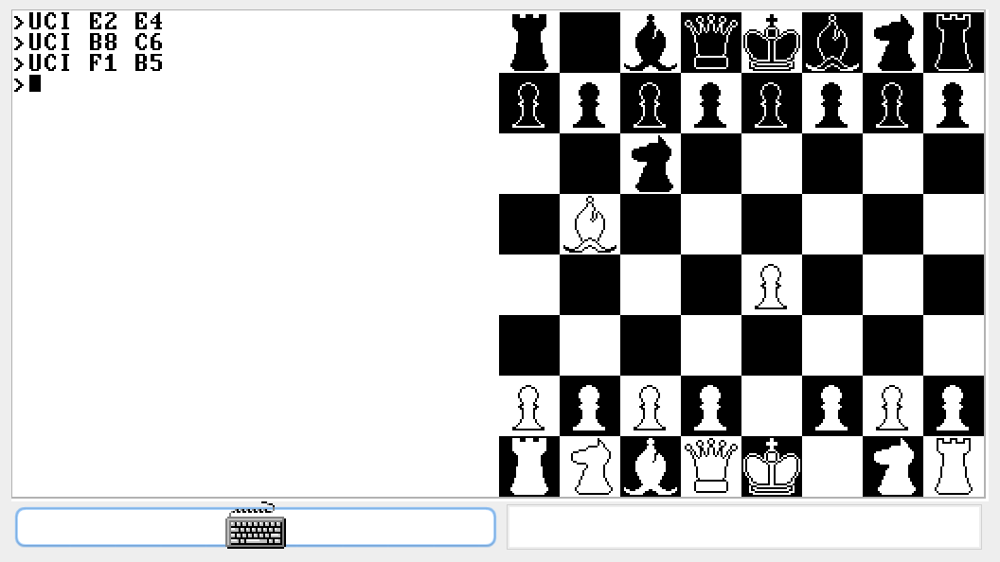

# Overview
Coursework for https://www.nand2tetris.org/, a 12-part independent study where you build a virtual computer from the ground up starting from logic gates.

# Final Product
For my final project I implemented chess using the Jack programming

